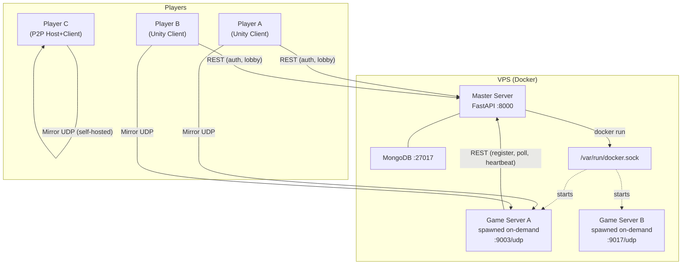
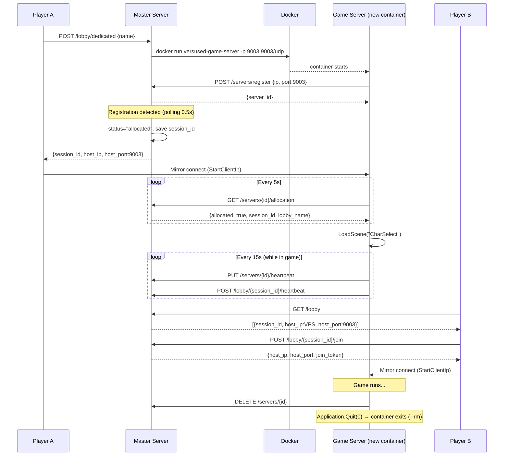
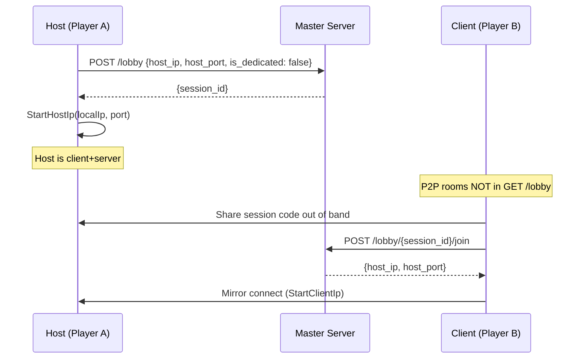

# VersusD — Architecture & Deployment Guide

## Overview

VersusD supports two room creation modes:

| Mode | Host | Visible in search |
|------|------|-------------------|
| **P2P** | Player's own PC | No (join by code only) |
| **Dedicated** | VPS game server (on-demand) | Yes |

Public lobby search always shows only dedicated server rooms. Dedicated game server containers are **spawned on-demand** by the master server when a player creates a room — there is no fixed pool.

---

## System Architecture



---

## Dedicated Server Lifecycle (On-Demand)



---

## P2P Room Flow



---

## API Reference

### Auth
| Method | Path | Auth | Description |
|--------|------|------|-------------|
| POST | `/auth/register` | No | Register new user |
| POST | `/auth/login` | No | Login |
| POST | `/auth/guest` | No | Anonymous login |

### Lobbies
| Method | Path | Auth | Description |
|--------|------|------|-------------|
| GET | `/lobby` | No | List public dedicated lobbies |
| POST | `/lobby` | Yes | Create P2P lobby |
| POST | `/lobby/dedicated` | Yes | Spawn game server + create lobby |
| POST | `/lobby/{id}/join` | Yes | Join lobby, get connection info |
| DELETE | `/lobby/{id}/leave` | Yes | Leave / close lobby |
| POST | `/lobby/{id}/heartbeat` | No | Keep lobby alive (every 15s) |

### Dedicated Servers (called by game server process, not players)
| Method | Path | Auth | Description |
|--------|------|------|-------------|
| POST | `/servers/register` | No | Server registers on startup |
| PUT | `/servers/{id}/heartbeat` | No | Server keepalive (every 15s) |
| GET | `/servers/{id}/allocation` | No | Poll for game allocation |
| DELETE | `/servers/{id}` | No | Unregister on clean shutdown |

### Stats
| Method | Path | Auth | Description |
|--------|------|------|-------------|
| POST | `/stats/match-result` | Yes | Report match outcome |
| GET | `/stats/{player_id}` | No | Get player stats |

---

## Deployment Guide

### Prerequisites
- VPS with Ubuntu 22.04+ (2 vCPU minimum, 2 GB RAM minimum)
- Docker + Docker Compose installed
- Ports open in firewall:
  - **8000/TCP** — Master server REST API
  - **9000–9999/UDP** — Game server range (one port per concurrent match)

### 1. Clone and configure

```bash
git clone <your-repo> /opt/versused
cd /opt/versused/master-server
```

Create `.env` (copy from `.env.example` if present):
```env
SECRET_KEY=replace-with-a-random-64-char-string
VPS_PUBLIC_IP=1.2.3.4
```

Generate a secret key:
```bash
python3 -c "import secrets; print(secrets.token_hex(32))"
```

### 2. Build the game server Docker image

On the VPS, before starting anything:

```bash
# Copy your Linux Unity headless build to master-server/game-server/
scp -r path/to/LinuxBuild/* user@your-vps:/opt/versused/master-server/game-server/

# Build the image on the VPS
cd /opt/versused/master-server
docker build -f Dockerfile.gameserver -t versused-game-server ./game-server
```

> The image name must match `GAME_SERVER_IMAGE` in docker-compose.yml (`versused-game-server`).

### 3. Start master server

```bash
docker compose up -d
docker compose logs -f master-server
```

Verify: `curl http://localhost:8000/docs`

### 4. Test on-demand spawning

```bash
# Create a user and get a token
curl -X POST http://localhost:8000/auth/register \
  -H "Content-Type: application/json" \
  -d '{"username":"test","password":"test123"}'

# Create a dedicated room (this spawns a container)
curl -X POST http://localhost:8000/lobby/dedicated \
  -H "Authorization: Bearer <token>" \
  -H "Content-Type: application/json" \
  -d '{"name":"TestRoom","max_players":4}'

# Watch the container appear
docker ps
```

Expected: a `gs-XXXXXXXX` container appears, then disappears when the game ends.

### 5. Open firewall (UFW example)

```bash
ufw allow 8000/tcp
ufw allow 9000:9999/udp
ufw reload
```

### 6. Scaling

The system scales **vertically** — more RAM on the VPS = more concurrent matches.  
Each Unity headless instance uses ~200–400 MB RAM.

| VPS RAM | Max concurrent matches |
|---------|----------------------|
| 2 GB    | ~4                   |
| 4 GB    | ~8                   |
| 8 GB    | ~18                  |

To expand the port range, change `GAME_SERVER_PORT_START`/`GAME_SERVER_PORT_END` in docker-compose.yml and open the corresponding firewall ports.

---

## Unity Build Guide

### Build steps

1. In Unity Editor: **File → Build Settings**
2. Switch platform to **Linux** (x86_64)
3. Check **☑ Server Build** — disables GPU, reduces RAM, required for headless mode
4. Click **Build** → output to `master-server/game-server/`
5. Output: `VersusD.x86_64` + `VersusD_Data/`

### Scene setup

`DedicatedServerBootstrapper` must be on a `DontDestroyOnLoad` GameObject in the **Startup scene**. Assign a `MasterServerConfig` ScriptableObject with `baseUrl` pointing to the master server.

In headless mode the `ApplicationController` should skip MainMenu. Simplest approach — in `ApplicationController.Start()`:

```csharp
if (Application.isBatchMode)
{
    // DedicatedServerBootstrapper handles everything
    return;
}
// ... normal client startup
```

### Checklist

- [ ] `DedicatedServerBootstrapper` in Startup scene, `MasterServerConfig` assigned
- [ ] `ApplicationController` skips MainMenu in batch mode
- [ ] `OnMatchEnded()` called from `ServerBossRoomState.CoroGameOver()` ✅ (already wired)
- [ ] Build target: **Linux x86_64**, **Server Build** checked
- [ ] Image built on VPS: `docker build -t versused-game-server ./game-server`

---

## Environment Variables Reference

### Master Server
| Variable | Default | Description |
|----------|---------|-------------|
| `SECRET_KEY` | `change-me-in-prod` | JWT signing key |
| `MONGO_URL` | `mongodb://localhost:27017` | MongoDB connection string |
| `DB_NAME` | `versused` | MongoDB database name |
| `VPS_PUBLIC_IP` | `127.0.0.1` | Public IP sent to players to connect |
| `GAME_SERVER_IMAGE` | `versused-game-server` | Docker image name for game servers |
| `GAME_SERVER_PORT_START` | `9000` | Start of UDP port range |
| `GAME_SERVER_PORT_END` | `9999` | End of UDP port range |
| `DOCKER_NETWORK` | `master-server_versused` | Docker network name for spawned containers |
| `MASTER_SERVER_INTERNAL_URL` | `http://master-server:8000` | URL used by containers to reach the master |

### Game Server (injected by master server at spawn time)
| Variable | Description |
|----------|-------------|
| `MASTER_SERVER_URL` | URL to reach the master server |
| `SERVER_IP` | Public IP of the VPS (reported to master on register) |
| `SERVER_PORT` | UDP port this instance listens on |

---

## Timers & TTLs

| Timer | Value | Description |
|-------|-------|-------------|
| Server heartbeat | 15s | Game server → master keepalive |
| Lobby heartbeat | 15s | Lobby TTL refresh (sent by game server) |
| Lobby TTL | 40s | Lobby auto-removed if no heartbeat |
| Server stale TTL | 60s | Server doc deleted if no heartbeat (crash recovery) |
| Server allocation poll | 5s | How often DS polls for its allocation |
| Container spawn timeout | 20s | Master waits this long for container to register |
| Join token TTL | 60s | One-time token for game server auth |
| Graceful shutdown delay | 2s | After match ends, before `Application.Quit()` |
